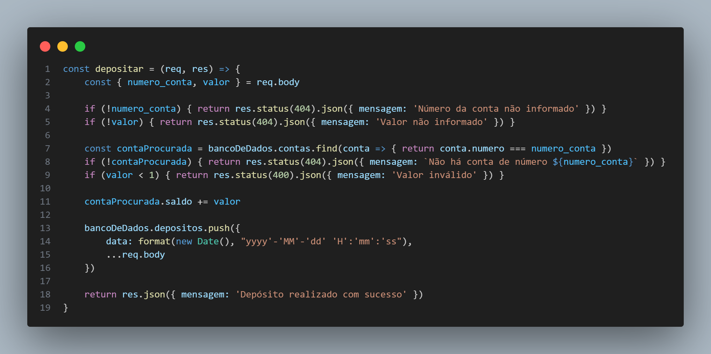

# Conta Bancária

Nesse projeto foi construído uma RESTful API para o melhor banco digital, o **Mag Bank**, que permite:
-   Listagem de contas bancárias
-   Criar conta bancária
-   Atualizar os dados do usuário da conta bancária
-   Excluir uma conta bancária
-   Depositar em uma conta bancária
-   Sacar de uma conta bancária
-   Transferir valores entre contas bancárias
-   Consultar saldo da conta bancária
-   Emitir extrato bancário

Detalhe: Sempre que a validação de uma requisição falhar, haverá uma resposta com código de erro e mensagem adequada à situação, ok?

**Exemplo:**

```javascript
// Quando é informado um número de conta que não existe:
// HTTP Status 404
{
    "mensagem": "Nenhuma conta foi localizada"
}
```
## **Persistências dos dados**

Os dados serão persistidos em memória, no objeto existente dentro do arquivo `bancodedados.js`. Todas as transações e contas bancárias deverão ser inseridas dentro deste objeto, seguindo a estrutura que já existe.

### **Estrutura do objeto no arquivo `bancodedados.js`**

```javascript
{
    banco: {
        nome: "Mag Bank",
        numero: "666",
        agencia: "0001",
        senha: "123",
    },
    contas: [
        // array de contas bancárias
    ],
    saques: [
        // array de saques
    ],
    depositos: [
        // array de depósitos
    ],
    transferencias: [
        // array de transferências
    ],
}
```
## **Como utilizar** 

Será necessário instalar o gerenciador de pacotes para o Node.JS, npm, por meio dos códigos no terminal:

```javascript
// npm init -y
// npm i
// npm run dev
```
Além de utilizar alguma ferramenta de teste de API Client, como o Insomnia, por exemplo, para fazer as requisições.

https://insomnia.rest/download 

No final de todas requisições, é fundamental colocar a senha do banco como validação (a porta do servidor é a 300).

#### **Exemplo**
```javascript
// http://localhost:3000/requisicao?senha_banco=123
```
## **Rotas de requisições**

### **Criar conta bancária**

#### `POST` `/contas`

Essa é a rota que será utilizada para criar uma conta bancária, onde será gerado um número único para identificação de cada conta.

#### **Exemplo de requisição**

```javascript
{
    "nome": "Foo Bar",
    "email": "foo@bar.com",
    "cpf": "00011122233",
    "data_nascimento": "15/03/2001",
    "telefone": "11999998888",
    "senha": "321"
}
```

### **Listar contas bancárias**

#### `GET` `/contas`

Essa é a rota que será utilizada para listar todas as contas bancárias existentes.


### **Atualizar usuário da conta bancária**

#### `PUT` `/contas/:numeroConta/usuario`

Essa é a rota que será utilizada para atualizar os dados do usuário de uma conta bancária.

#### **Exemplos de requisição**

```javascript
{
    "nome": "Bar Foo",
    "email": "bar@foo.com",
    "telefone": "11988889999",
}
```

### **Excluir Conta**

#### `DELETE` `/contas/:numeroConta`

Essa é a rota que será utilizada para excluir uma conta bancária existente.


### **Depositar**

#### `POST` `/transacoes/depositar`

Essa é a rota que será utilizada para somar o valor do depósito ao saldo de uma conta válida e registrar essa transação.

#### **Exemplo de requisição**

```javascript
{
    "numero_conta": "1",
    "valor": 10000
}
```

### **Sacar**

#### `POST` `/transacoes/sacar`

Essa é a rota que será utilizada para realizar o saque de um valor em uma determinada conta bancária e registrar essa transação.

#### **Exemplo de requisição**

```javascript
{
    "numero_conta": "1",
    "valor": 10000,
    "senha": "321"
}
```

### **Transferir**

#### `POST` `/transacoes/transferir`

Essa é a rota que será utilizada para  para realizar a transferência de saldo de uma conta bancária para outra e registrar essa transação.

#### **Exemplo de requisição**

```javascript
{
    "numero_conta_origem": "1",
    "numero_conta_destino": "1",
    "valor": 10000,
    "senha": "321"
}
```

### **Consultar Saldo**

#### `GET` `/contas/saldo?numero_conta=123&senha=123`

Essa é a rota que será utilizada para retornar o saldo de uma conta bancária.

#### **Exemplo de requisição**

```javascript
// GET /contas/saldo?numero_conta=numero-da-conta&senha=senha-da-conta
```

### Extrato

#### `GET` `/contas/extrato?numero_conta=123&senha=123`

Essa é a rota que será utilizada para  listar as transações realizadas de uma conta específica.

#### **Exemplo de requisição**

```javascript
// GET /contas/extrato?numero_conta=numero-da-conta&senha=senha-da-conta
```
